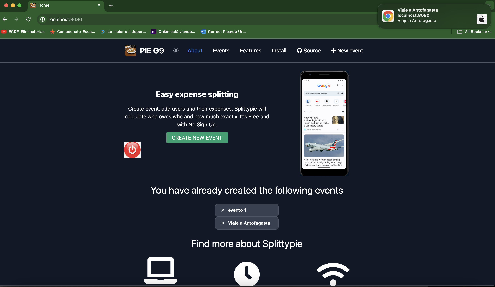
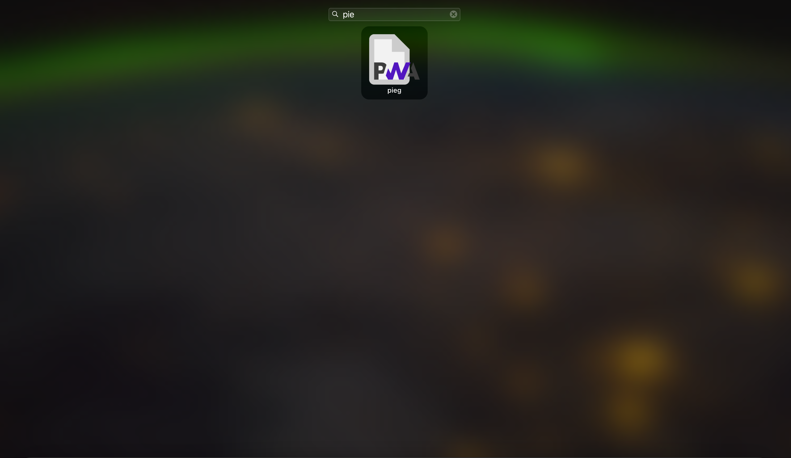
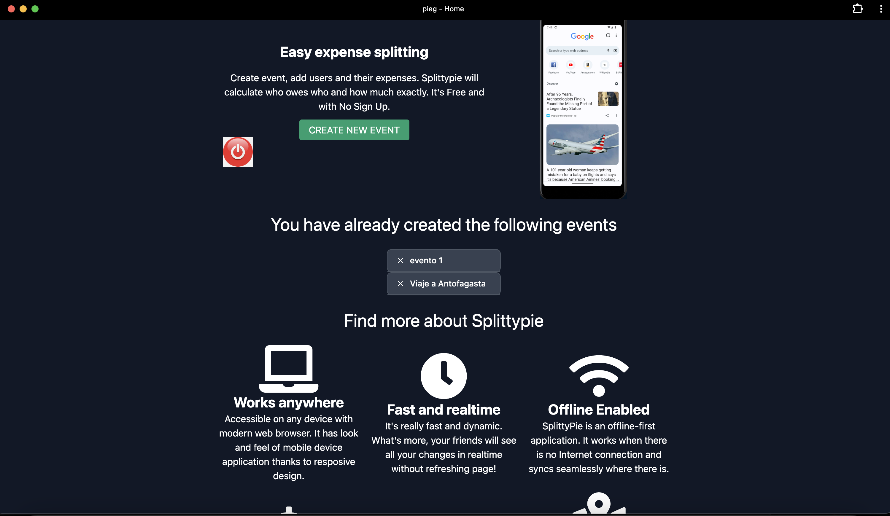
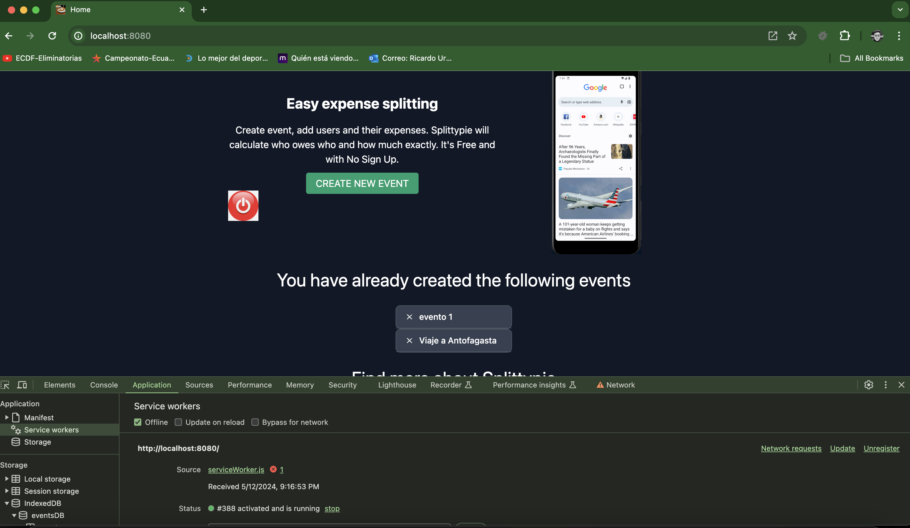

# SplittyPie Clone

This project is a Progressive Web Application (PWA) that replicates the functionality
of [SplittyPie](https://splittypie.com). The application allows users to create events and manage expenses in a
user-friendly and efficient manner.

## Features

- **Create Events**: Users can create new events and manage them independently.
- **Manage Expenses**: Within each event, users can add expenses and assign them to participants.
- **Responsive Design**: The application is designed to be used on any device, with a responsive layout that adapts to
  different screen sizes.
- **Offline Functionality**: As a PWA, the application can be used even when there is no internet connection, with
  changes syncing seamlessly when the connection is restored.

## Technologies

This project is built using the following technologies:

- **JavaScript**: Used for the application logic and user interaction.
- **Tailwind CSS**: A utility-first CSS framework used for styling the application.
- **Flowbite**: A JavaScript library that provides interactive components for Tailwind CSS.

## Create firebase project

To use the notifications you must create a firebase project

1. Create a firebase project.
2. In the settings of the project go to the Cloud Messaging section.
3. Create a server key
4. In general option of settings you must create a new web app
5. Copy the configuration of the app.

## Installation

To install and run this project, follow these steps:

1. Clone the repository: `git clone https://github.com/IIC3585-2024/pwa-group-09`
2. Navigate to the project directory: `cd pwa-group-09`
3. Install the dependencies: `npm install`
4. Start the development server: `npm start`
5. Copy config.example.js to config.js and fill the values with your firebase project configuration.
6. Copy config_fcm_sw.example.js to config_fcm_sw.js and fill the values with your firebase project configuration.

Open [http://localhost:8080](http://localhost:8080) to view the application in your browser.

To send notifications, you need to run the following steps:

1. Once your server is running, open a new console window in the browser.
2. You will see a message that says "Token is: " followed by a token.
3. Copy the token and paste it in the "Token" field in the "Send Notification" section.
4. In manifest.json you must change the value of "gcm_sender_id" with the value of the project number of your firebase
   project.
5. In postman open the file send_notifications.postman.json.
6. In postman in body section raw option, change the token to the one you copied.
7. In headers section you must change the key of authorization with your own key that you can find in the Cloud
   Messaging of your firebase project
8. Send the notification.
9. You will receive a notification in the browser.

Example of notification:

Example of using offline mode:

App installed in mac:

App installed in Iphone

## Usage

To use the application, navigate to the hosted URL and start by creating a new event. You can then add participants and
their respective expenses to the event. The application will automatically calculate who owes who and how much.

## Contributing

Contributions to this project are welcome. If you find a bug or have a suggestion for improving the application, feel
free to open an issue or submit a pull request.

## License

This project is licensed under the terms of the MIT license.

## Team Members

Jose Cáceres, Ricardo Urvina, Sofía Villalobos.
